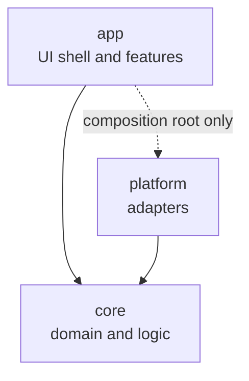
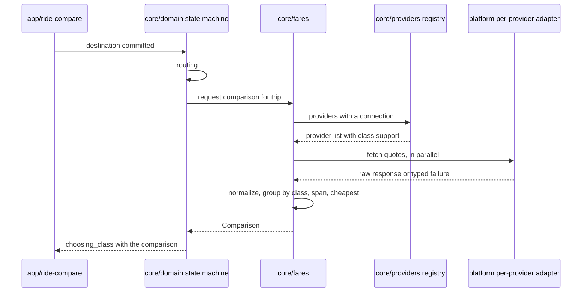

# Architecture and repo structure

No language, framework, or SDK is chosen. This document describes the shape the code takes regardless of that choice, so the stack decision, when it lands as an ADR, changes what fills the modules rather than what the modules are.

## What the structure is protecting

Three things about Rydar are known to be unstable, and the structure exists to keep each of them from spreading.

**Fare acquisition will change repeatedly.** No provider offers a public fare API to third parties, so whatever mechanism works today breaks when a provider changes something. This must be replaceable per provider without touching the comparison screen.

**The map SDK is undecided and swappable.** Camera behavior is specified as intents in [MAP.md](MAP.md) precisely so the SDK sits behind one adapter.

**The platform is undecided.** The domain model in [DOMAIN.md](DOMAIN.md), the comparison logic, and the state machine are all platform-independent, and writing them that way keeps a platform change from being a rewrite.

Everything below follows from those three.

## Three rings



`core` is pure. It defines the domain, the logic, and the ports. It imports nothing from `platform` or `app`, and nothing from any UI or SDK library.

`platform` implements `core`'s ports against concrete technology. It depends on `core` and on SDKs. It contains no business rules.

`app` renders. It depends on `core` for state and types, and it reads `platform` only at the composition root where adapters are constructed and injected.

**The one hard rule.** `core` imports nothing from `platform` or `app`. This is the rule that pays for itself, because it is what lets the comparison logic be tested without a device, a map, or a network, and it is the first rule to erode if nobody is watching. It has to be mechanically enforced once a stack exists; see Enforcement below.

## Expected repo structure

```
README.md          entry point and doc map
PRODUCT.md         product spec
DESIGN.md          design system, tokens TBD
AGENTS.md          how to work in this repo

core/
  domain/          entities, value objects, the PlanningState machine
  fares/           normalization, class grouping, comparison and ranking
  providers/       provider registry and the FareProvider port
  geo/             geocoding, place search, and routing ports
  storage/         bookmark, recent, history, and connection ports

platform/
  map/             map SDK adapter, camera intents to SDK calls
  deeplink/        provider handoff, installed-app detection, fallbacks
  http/            transport, session handling, credential access
  persistence/     local storage and secure credential storage

app/
  features/
    connect/       Connected apps sheet and connection detail
    trip-planning/ Where to sheet, location picker, map coordination
    ride-compare/  Choose your ride sheet, provider rows, fare detail, handoff
    history/       comparison history

docs/              specs, research, decisions, templates
tools/             repo tooling, starting with check-docs
```

Feature folders in `app/` mirror the flow in [FLOWS.md](FLOWS.md) rather than mirroring component types. There is no global `components/` bucket at the top level. A shared UI primitive earns a shared home only when a second feature actually needs it, and until then it lives with its one consumer.

## Module responsibilities

### core/domain

Owns every shape in [DOMAIN.md](DOMAIN.md) and the `PlanningState` machine, including the transition function. State transitions are pure: current state plus an event produces the next state, with no side effects and no awaits.

Forbidden here. Anything asynchronous, any formatting for display, any knowledge that a UI exists.

### core/fares

Turns raw provider responses into `QuoteResult` values, groups them into `ClassGroup` values by `RideClass`, computes the fare span, and identifies the cheapest available quote. Owns freshness evaluation, meaning the decision that turns a `fresh` quote into a `stale` one.

Normalization lives here rather than in each provider adapter, so that the rules for what counts as a comparable price exist once and can be reasoned about together. A provider adapter's job ends at reporting what the provider said.

### core/providers

Holds the registry, which is the single source of truth for which providers exist, which `RideClass` values each serves, how each provider's own tier names map onto those classes, and what each one's handoff link can carry. This is data, per [PROVIDERS.md](PROVIDERS.md). Adding a provider is a registry entry plus an adapter, and it touches no UI.

Also defines the `FareProvider` port, contracted in [CONNECT.md](CONNECT.md).

### core/geo

Ports for forward geocoding and place search, reverse geocoding for dropped pins, and routing. Also the pure geometry helpers the map needs, meaning bounding box computation from a coordinate list and distance along a path, since the route draw's distance-based progression is math and not an SDK feature.

### core/storage

Ports for bookmarks, recents, comparison history, and connection records. Defines the retention rules, such as the size of the recents window and the immutability of a written history entry.

### platform/map

The only module that knows which map SDK Rydar uses. Accepts a `CameraIntent`, maps zoom tiers to SDK zoom values, computes the visible region from viewport and sheet occlusion, renders the route layers, and drives the draw animation inside the SDK rather than from application code. Reports gesture ownership back up so the state layer can suppress camera intents.

Every rule this module has to satisfy is in [MAP.md](MAP.md).

### platform/deeplink

Attempts the provider app, then the web fallback, then the store listing. Detects installation where the platform allows it. Builds the link from the registry's handoff descriptor, which is what keeps per-provider link quirks out of the comparison feature.

### platform/http

Transport for provider fare requests. Owns timeouts, retry and backoff, rate-limit handling, and credential attachment. Credentials pass through here and are stored by `platform/persistence` in the platform keystore, never in plain local storage and never in a log.

### platform/persistence

Local storage for bookmarks, recents, history, and connection records, plus secure storage for credentials. Owns migration when a stored shape changes.

### app/features/\*

Each feature owns its surfaces, subscribes to the state it needs, and dispatches events into the state machine. A feature never calls `platform` directly, never holds domain logic, and never reaches into another feature's internals. Cross-feature communication happens through the state machine, which is what keeps the Connected apps sheet from having an opinion about the comparison screen.

## Ports

The complete set of boundaries between `core` and the outside world. Naming is illustrative; the count and the responsibilities are the point.

| Port | Owned by | Implemented by | Responsibility |
| --- | --- | --- | --- |
| `FareProvider` | `core/providers` | `platform` per provider | Fetch quotes for a trip, or fail with a reason |
| `ConnectionStore` | `core/storage` | `platform/persistence` | Read and write connection records |
| `PlaceSearch` | `core/geo` | `platform` | Forward geocoding and search |
| `ReverseGeocoder` | `core/geo` | `platform` | Coordinate to a label, for dropped pins |
| `Router` | `core/geo` | `platform` | Origin and destination to `RouteGeometry` |
| `CameraController` | `core/domain` | `platform/map` | Accept a `CameraIntent` |
| `Handoff` | `core/providers` | `platform/deeplink` | Open a provider app with a fallback chain |
| `BookmarkStore` | `core/storage` | `platform/persistence` | Bookmarks and recents |
| `HistoryStore` | `core/storage` | `platform/persistence` | Append and read comparison snapshots |
| `Clock` | `core/domain` | `platform` | Current time |

`Clock` is a port because freshness is central to the product and a hardcoded system clock makes staleness untestable. It is a small port that buys a lot of confidence.

Every port that can fail returns a typed failure rather than throwing a raw platform error. A `FareProvider` failure is an `UnavailableReason` from [DOMAIN.md](DOMAIN.md), because that reason is what the UI renders and it must not be a stringly-typed message that varies per provider.

## One comparison, end to end



Properties worth naming. Provider fetches run in parallel and settle independently, which is what lets rows populate as they land instead of blocking on the slowest provider. A failing provider produces a typed `unavailable` result and never fails the whole comparison. Normalization happens in one place after the fetch, not inside each adapter.

## Where state lives

One state machine, in `core/domain`, holding `PlanningState`. The UI subscribes and dispatches; it does not own planning state.

Local, ephemeral state stays local. A search field's text, a sheet's current drag offset, a scroll position. The test is whether losing it on a state transition would be a bug. Search text can be lost when the picker closes. A picked destination cannot.

The comparison is held inside the state that owns it, per [DOMAIN.md](DOMAIN.md), which is what makes it structurally impossible to show a comparison for a trip the user has already changed.

## Enforcement

The dependency rule is worth nothing if it is only written down. Once a stack exists, the composition-root ADR must also land the mechanism, which is one of a module boundary lint rule, a build-level module graph constraint, or a CI script walking imports. The mechanism is `TBD` because it depends on the language, but shipping the structure without it is not acceptable, since an unenforced layering rule is broken within a month by people who meant well.

Until then, the enforced check is [../tools/check-docs.mjs](../tools/check-docs.mjs), which validates the documentation set. Its existence is also the pattern to follow: a rule worth stating twice is worth encoding once.

## Testing strategy

- **`core` is unit tested with no platform present.** Fake every port. This covers the state machine transitions, normalization, grouping, span and cheapest computation, and freshness. It is the majority of the test suite and it runs in milliseconds.
- **`platform` adapters are tested against recorded responses,** so a provider changing its interface shows up as a failing adapter test rather than an empty comparison screen.
- **`app` is verified on the real surface.** A simulator or device, driving the actual flow. A passing unit test does not demonstrate that the camera framed the route inside the visible region; only looking at it does.
- **The route draw and camera choreography must be verified visually and profiled on mid-range Android hardware.** Per [MAP.md](MAP.md), that measurement is what decides whether the draw animation survives.

## Deliberately undecided

Language, framework, and package manager. Map SDK, geocoding provider, and routing provider. Whether provider fetches run on-device or through a Rydar-operated service, which is the largest open question and is scoped in [CONNECT.md](CONNECT.md). State management library. Testing framework. The dependency-rule enforcement mechanism.

Each becomes an ADR in [DECISIONS](DECISIONS/README.md) when it is made. Candidate analysis lives in [RESEARCH/stack-candidates.md](RESEARCH/stack-candidates.md) and must not be read as a decision.

## Changelog

- 2026-07-26 `0.1.0` Initial version. Established the three rings, the core-imports-nothing rule, module responsibilities, the ten ports, and the comparison data flow.
