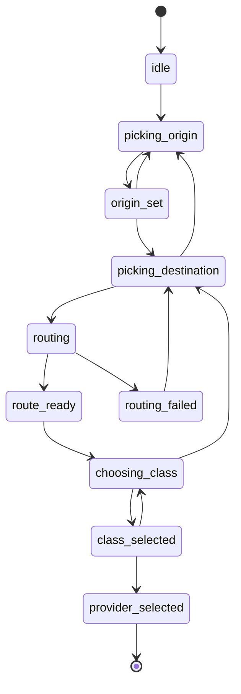

# Domain model

This is the vocabulary every other Rydar document uses. Read it before [FLOWS.md](FLOWS.md), [MAP.md](MAP.md), or [CONNECT.md](CONNECT.md), because those describe behavior in terms of the shapes named here.

## Notation

The blocks below are pseudocode, not any chosen language. `record` is a product type. `oneof` is a tagged union where exactly one variant holds at a time. `?` marks an optional field. A closed set written with `|` is an enumeration.

Each shape maps cleanly to structs and enums, to interfaces and discriminated unions, or to data classes and sealed classes. Picking the language does not change the model.

## Why the model looks like this

Three rules shaped it.

Illegal states are unrepresentable. There is no `Trip` with a null destination and no `FareQuote` with a null price. A half-filled trip lives inside a planning state that only exposes the fields that state actually has. This is why `PlanningState` carries its own data rather than the UI reading nullable globals.

Absence carries a reason. A provider that returns nothing is not an empty list. It is `Unavailable` with a cause, so the UI can say why instead of showing a blank row and letting the user guess.

Provider quirks live in the model, not in branches. inDrive names its own price, Angkas sells a raincoat, taxis meter by distance. Those are variants of `FareShape` and entries in `addOns`, not `if provider == "indrive"` scattered across the comparison screen.

## Geography

```
record Coordinate {
  latitude:  decimal degrees, WGS 84
  longitude: decimal degrees, WGS 84
}

record BoundingBox {
  southWest: Coordinate
  northEast: Coordinate
}
```

`BoundingBox` is the only input the map camera needs to frame two pins. See [MAP.md](MAP.md).

## Place

A `Place` is a named point the user can pick as an origin or a destination.

```
record Place {
  id:         PlaceId          stable within a session
  label:      text             "SM Mall of Asia"
  subLabel:   text?            "Pasay"
  coordinate: Coordinate
  source:     PlaceSource
}

PlaceSource = current_location | search | bookmark | recent | map_pin
```

`source` exists because provenance changes behavior. A `map_pin` place has no trustworthy name and must be reverse geocoded before it appears in history. A `bookmark` place keeps the user's own label even when geocoding disagrees. A `current_location` place goes stale and must be refreshed if the sheet sits open.

```
record Bookmark {
  id:        BookmarkId
  place:     Place
  label:     text             the user's name for it, "House"
  createdAt: timestamp
}
```

Bookmarks and recents are both sources of `Place`, and they are distinct records because a bookmark is curated and permanent while a recent is a rolling window that expires.

## Route

```
record RouteGeometry {
  path:            list of Coordinate    ordered, origin first
  bounds:          BoundingBox
  distanceMeters:  integer
  durationSeconds: integer
  provider:        RouteSource
  capturedAt:      timestamp
}

RouteSource = TBD (routing provider undecided, see RESEARCH/map-motion-candidates.md)
```

`path` is dense enough to animate along. The draw animation in [MAP.md](MAP.md) walks it by distance, so evenly spaced points matter more than point count.

Rydar's own route is a display and sanity-check artifact. It is not the distance a provider bills. Providers report their own trip distance, and those numbers disagree in practice, which the comparison surface must show rather than hide. See the distance divergence note in [FLOWS.md](FLOWS.md).

## Trip

```
record Trip {
  origin:      Place
  destination: Place
  route:       RouteGeometry
}
```

Every field is required. A `Trip` only exists once routing has succeeded, which is what makes it safe for the comparison layer to assume it is complete. Incomplete state belongs to `PlanningState` below.

## Ride class

```
RideClass = motorcycle | car_4 | car_6 | taxi | comfort_xl
```

This is Rydar's vocabulary, not any provider's. It is the grouping the user sees in the Choose your ride sheet. Providers name the same thing differently, so every provider entry carries its own label, and the mapping from a provider tier to a Rydar class is data in the registry rather than logic in the UI. See [PROVIDERS.md](PROVIDERS.md).

The set is closed on purpose. Adding a class is a deliberate registry and design change, not an incidental effect of a provider shipping a new tier.

## Provider

```
record Provider {
  id:            ProviderId       stable slug, "angkas"
  displayName:   text             "Angkas"
  rideClasses:   list of RideClass
  connect:       ConnectCapability
  handoff:       HandoffDescriptor
}

oneof ConnectCapability {
  supported   {}
  planned     {}
  unsupported { reason: text }
}

record HandoffDescriptor {
  appScheme:     TBD (per-provider deep link scheme unverified)
  webFallback:   TBD
  storeListing:  TBD
  prefillFields: list of (origin | destination | rideClass)
}
```

`prefillFields` is a list rather than a boolean because providers differ in how much of a trip a link can carry. Some accept both endpoints, some only open the app cold. The handoff surface reads this list to decide what it can honestly promise the user.

## Connection

A connection is Rydar's authorization to ask a provider for prices on the user's behalf. The mechanism is out of scope here and specified as a port in [CONNECT.md](CONNECT.md).

```
oneof Connection {
  connected    { providerId, accountLabel: text?, connectedAt: timestamp, expiresAt: timestamp? }
  disconnected { providerId }
  expired      { providerId, since: timestamp }
  unsupported  { providerId, reason: text }
}
```

Four variants, not a boolean, because the Connected apps sheet has four different things to say. `expired` in particular must prompt a reconnect rather than silently look the same as never connected.

## Fare

```
record FareQuote {
  providerId:      ProviderId
  rideClass:       RideClass
  providerLabel:   text            the provider's own tier name, "GrabCar Comfort"
  fare:            FareShape
  currency:        Currency        PHP only for now
  distanceMeters:  integer         the provider's number, not Rydar's
  durationSeconds: integer?
  pickupEtaSeconds: integer?
  demand:          DemandSignal?
  addOns:          list of AddOn
  breakdown:       list of FareLine
  capturedAt:      timestamp
}

oneof FareShape {
  exact { amount: money }
  range { low: money, high: money }
  offer { suggested: money, min: money?, max: money? }
}
```

`FareShape` has three variants because providers price in three fundamentally different ways. A metered taxi gives a range. A fixed motorcycle fare gives one number. inDrive asks the rider to name a price, so its quote is an offer with a suggested value. Flattening all three into a low and high pair would fabricate precision the provider never gave, and it would make the offer model impossible to render honestly.

```
record AddOn {
  id:          text
  label:       text            "Rent-A-Raincoat"
  amount:      money
  feeAmount:   money?          platform fee charged on top
  requirement: optional | conditional
}

record FareLine {
  label: text
  amount: money
  kind:  base | distance | time | surge | fee | discount | addon
}

record DemandSignal {
  level:         normal | elevated | high
  multiplier:    decimal?        "6.4x busier than usual"
  driversNearby: integer?
  ridersWaiting: integer?
  note:          text?           "Rain mode active in your area"
}
```

`DemandSignal` is optional on the quote and every field inside it is optional, because providers expose wildly different amounts of this. The detail sheet renders whichever fields are present and omits the rest rather than showing zeros.

## Quote result

```
oneof QuoteResult {
  fresh       { quote: FareQuote }
  stale       { quote: FareQuote, ageSeconds: integer }
  unavailable { providerId, rideClass, reason: UnavailableReason }
}

UnavailableReason =
    not_connected
  | needs_reauth
  | no_service_for_class
  | outside_coverage
  | provider_error
  | timeout
  | rate_limited
```

This is the single most load-bearing shape in the app. Rydar's entire value is a truthful side-by-side, and a comparison that silently drops a provider is worse than one that says the provider timed out. Every reason maps to specific copy and a specific user action, spelled out in [FLOWS.md](FLOWS.md).

`stale` exists because a fare fetched ninety seconds ago is still useful and still needs a visible age. Deciding when `fresh` becomes `stale` is a per-provider TTL, currently `TBD`.

## Comparison

```
record ClassGroup {
  rideClass: RideClass
  span:      FareSpan?        cheapest and dearest across available quotes
  results:   list of QuoteResult
}

record Comparison {
  id:          ComparisonId
  trip:        Trip
  requestedAt: timestamp
  groups:      list of ClassGroup
}
```

A `Comparison` is what the Choose your ride sheet renders, one `ClassGroup` per collapsed row. `span` is nullable because a group where every provider failed has no price to summarize, and that row must still appear so the user knows the class exists.

## Handoff and history

```
oneof HandoffOutcome {
  none        {}
  handed_off  { providerId, rideClass, quotedFare: FareShape, at: timestamp }
}

record HistoryEntry {
  id:           HistoryId
  originLabel:  text
  destLabel:    text
  requestedAt:  timestamp
  cheapest:     (ProviderId, RideClass, money)?
  outcome:      HandoffOutcome
  groups:       list of ClassGroup      snapshot, prices as quoted
}
```

History stores a snapshot, not a live reference. Prices move, and a record that silently updates is useless for the thing users actually want from it, which is checking whether the app they picked was the cheap one. Rydar cannot know whether a ride was ever booked, only that it handed the user off, which is why `HandoffOutcome` says `handed_off` and not `booked`.

## Planning state

The flow from a cold map to a provider handoff is a state machine. It is written as one because the alternative, a pile of booleans for `hasOrigin`, `isRouting`, `sheetOpen`, and `selectedClass`, admits combinations that make no sense and inevitably produces a screen showing a route with no destination.

```
oneof PlanningState {
  idle               { }
  picking_origin     { draftOrigin: Place? }
  origin_set         { origin: Place }
  picking_destination { origin: Place, draftDestination: Place? }
  routing            { origin: Place, destination: Place }
  route_ready        { trip: Trip }
  choosing_class     { trip: Trip, comparison: Comparison }
  class_selected     { trip: Trip, comparison: Comparison, rideClass: RideClass }
  provider_selected  { trip: Trip, comparison: Comparison, rideClass: RideClass, providerId: ProviderId }
  routing_failed     { origin: Place, destination: Place, reason: text }
}
```



Two properties matter. Every state carries exactly the data it has, so no consumer needs a null check to find out where it is. And the map camera is a pure function of this state, which is what keeps camera behavior out of the sheet components. That mapping is a lookup table in [MAP.md](MAP.md).

Editing either endpoint from a later state walks backward through the machine rather than patching a field in place. Changing the destination from `choosing_class` discards the comparison, because a comparison for a different trip is not stale, it is wrong.

## Invariants

- A `Trip` has a non-null origin, destination, and route. Anything less lives in `PlanningState`.
- `Comparison.trip` equals the `trip` of the state that holds it. A comparison never outlives the trip it was fetched for.
- Every `QuoteResult` in a `ClassGroup` names the same `rideClass` as the group.
- Every provider connected and capable of a class appears in that class group, as `fresh`, `stale`, or `unavailable`. Silence is never an option.
- `HistoryEntry.groups` is immutable once written.
- Money is an integer of the currency's minor unit. No floating point on a fare, ever.

## Open questions

- Per-provider quote TTL, the boundary between `fresh` and `stale`. `TBD`.
- Whether `RideClass` needs a delivery or multi-stop member once the flow supports added stops. `TBD`.
- Whether `Currency` stays single-valued. Metro Manila only for now, so `PHP` is hardcoded and the field exists to avoid a migration later.

## Changelog

- 2026-07-26 `0.1.0` Initial version. Named the core shapes, the three-variant `FareShape`, the reasoned `QuoteResult`, and the `PlanningState` machine.
